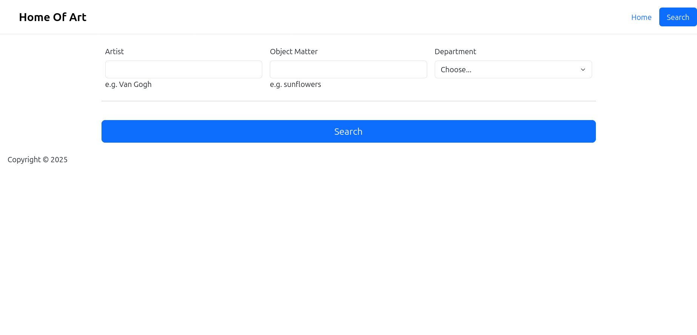
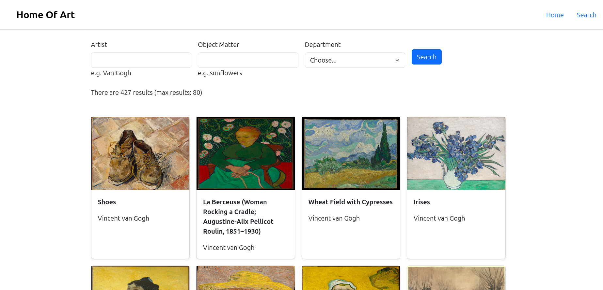

# Art of The Day
This website has a home page where a random piece of art is displayed, and a search page where users can search for artworks under certain criteria.
It uses the Metropolitan Museum's public API: [The Metropolitan Museum of Art Collection API](https://metmuseum.github.io/)
  
Screenshots:
  

  

To run the project, run `npm i` in the terminal under the root repository. After all packages are installed, run `node index.js`, and enter `localhost:3000` in your browser.
